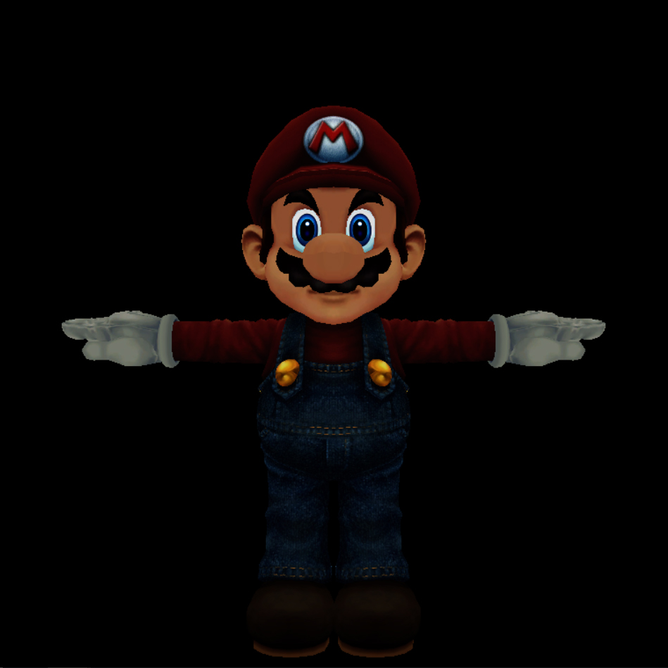
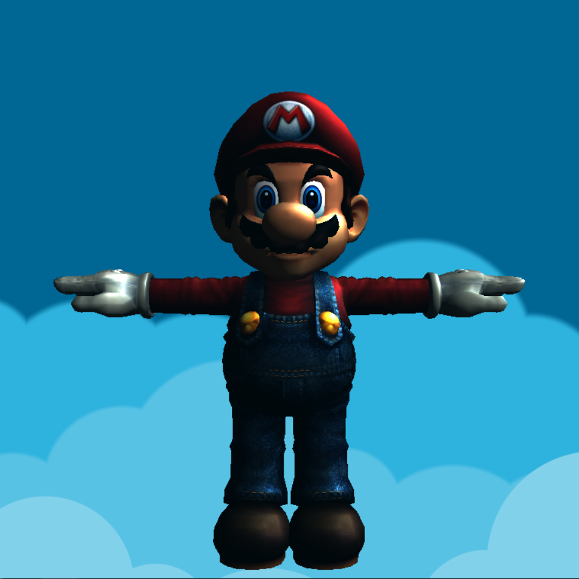
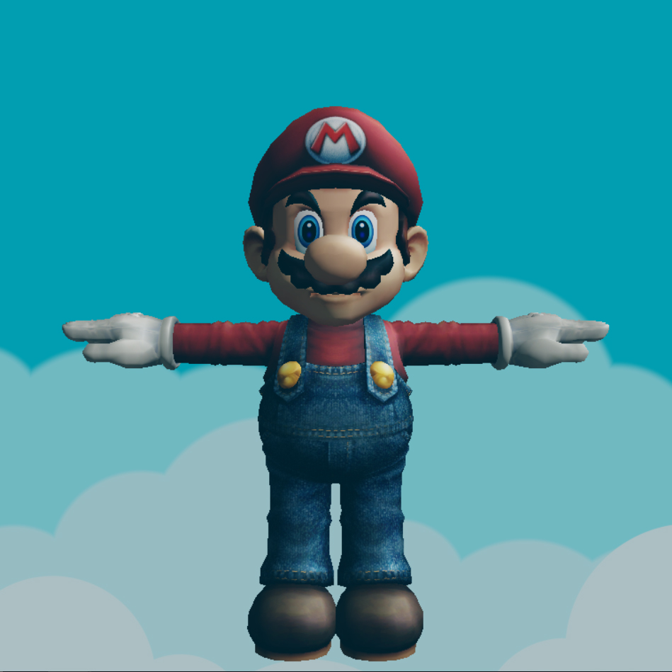
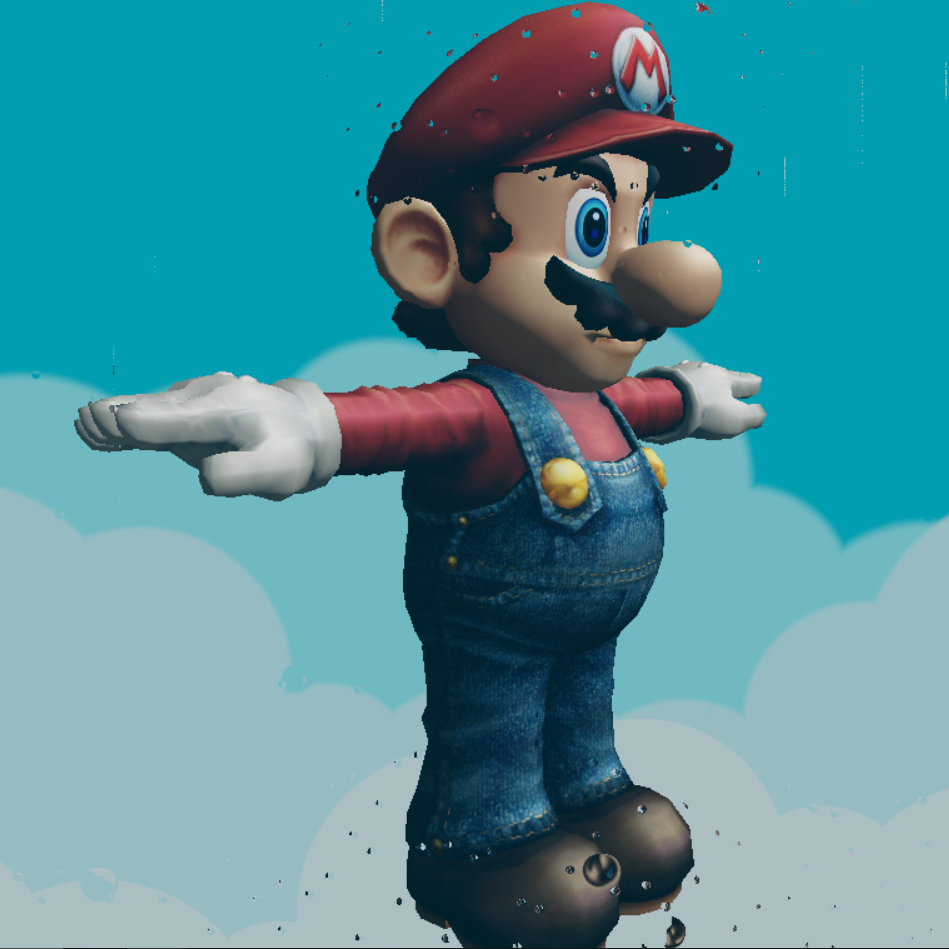
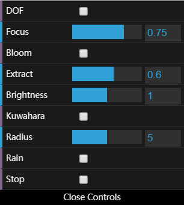

# CIS 566 Project 7: Deferred Renderer

* Name: Linshen Xiao
* PennKey: Linshen
* Tested on: Windows 10, Intel(R) Core(TM) i7-6700HQ CPU @ 2.60GHz, 16.0GB, NVIDIA GeForce GTX 970M (Personal computer)

## Demo

- [https://githublsx.github.io/homework-7-deferred-renderer-githublsx/](https://githublsx.github.io/homework-7-deferred-renderer-githublsx/);

## Assignment Description

**Goal:** Learn an advanced rendering technique using the OpenGL pipeline and apply it to make artistic procedural post-processing effects.

## Render pipeline overview

Here is an overview of how the provided code renders its final output:

Each `tick()`, the provided `OpenGLRenderer` will perform the following operations:

1. `renderToGBuffer`: Render the 3D scene (`wahoo.obj`) into its G-Buffers using `standard-vert.glsl` and `standard-frag.glsl`. 

2. `renderFromGBuffer`: Render the data in its G-Buffers into the first element of its `post32Buffers` array, which stores 32-bit colors rather than 8-bit colors so that the scene can be represented using high dynamic range values. 

3. `renderPostProcessHDR`: Iterate over the collection of `PostProcess`es stored in `OpenGLRenderer`'s `post32Passes` and apply each one, in sequence, to the image produced in the most recent render pass. 

4. `renderPostProcessLDR`: Any LDR post-process effects will be applied in sequence just like the HDR processes.

## Passing data to G-Buffers

I pass the following scene data out from `standard-frag.glsl`:

* Camera-space depth of the fragment.
* World-space surface normal of the fragment.
* Albedo (base color) of the fragment.

I use the 32-bit `gbTexture` to store both your surface normal and depth value; set its RGB to the surface normal's XYZ and its W to the depth value.

|depth|albedo|normal|
|--------------|--------------|--------------|
||||

## Basic scene shading

In `deferred-render.glsl`, I take the G-Buffer data that I output from the standard shader and implement:

* Lambertian surface reflection and fake Blinn-Phong.
* Ambient lighting, so areas that would be very dark are slightly lit.
* Directional illumination.
* An interesting procedural backdrop for your model. I add a sky and clout background from [here](https://www.shadertoy.com/view/4t23RR). I use the depth that stored in the G-Buffer to decide whether or not a pixel is overlapped by a mesh.

## HDR Tone Mapping
In `tonemap-frag.glsl`, I implement one of the tone mapping algorithms listed on the [Filmic Worlds blog](http://filmicworlds.com/blog/filmic-tonemapping-operators/) which is Uncharted2Tonemap.

|Original|tonemapping|
|--------------|--------------|
|||

## Post-process effects

I implement four of the effects.

* __Bloom:__ As a 32-bit HDR effect, I find and isolate areas of the image with a value higher than some parameter, then apply a blur effect and add that to the original image to apply a bloom effect. I got lots of information from [here](https://learnopengl.com/Advanced-Lighting/Bloom). I implement Gaussian blur method used from [here](https://www.shadertoy.com/view/XdfGDH). I modify the provided rendering pipeline as bloom requires storing frame data in two frame buffers at the same time.

|Original|Bloom|
|--------------|--------------|
|||

* __Approximated depth of field:__ I choose a "focal length" for the virtual camera and compare the camera-space Z coordinate of the fragments to that distance. The farther the Z coordinate is from that length, the stronger a blur effect I apply to that fragment. I used the Gaussian blur metioned above.

|Original|DOF|
|--------------|--------------|
|||

* __Artistic effect:__ I Implement a oil painting shader with kuwahara filter from [here](https://www.shadertoy.com/view/lls3WM).

|Original|Kuwahara|
|--------------|--------------|
|||

* __Rain effect:__:__ I Implement a rain drops effect shader modified from [here](https://www.shadertoy.com/view/MdfBRX). I also use a vignette effect shader so that the center of the screen won't be covered with rain drops.

|Original|Rain|
|--------------|--------------|
|||

## Extra credit

- I Implement an additional feature which is rain drops effect.
- I use Dat.GUI to make some element(s) of the post-processes interactive.
	- DOF: activate or deactivate the dof postprocess;
	- Focus: change the focus length of dof postprocess;
	- Bloom: activate or deactivate the bloom postprocess;
	- Extract: change the value of the extracted color;
	- Brightness: change the brightness of the bloom effect;
	- Kuwahara: activate or deactivate the kuwahara postprocess;
	- Radius: change the radius of kuwahara postprocess;
	- Rain: activate or deactivate the rain drop postprocess;
	- Stop: stop the time;

## Resources

- [Toon Cloud](https://www.shadertoy.com/view/4t23RR)
- [Filmic Tonemapping Operators](http://filmicworlds.com/blog/filmic-tonemapping-operators/)
- [Bloom](https://learnopengl.com/Advanced-Lighting/Bloom)
- [Gaussian blur](https://www.shadertoy.com/view/XdfGDH)
- [Kuwahara](https://www.shadertoy.com/view/lls3WM)
- [The Drive Home](https://www.shadertoy.com/view/MdfBRX)